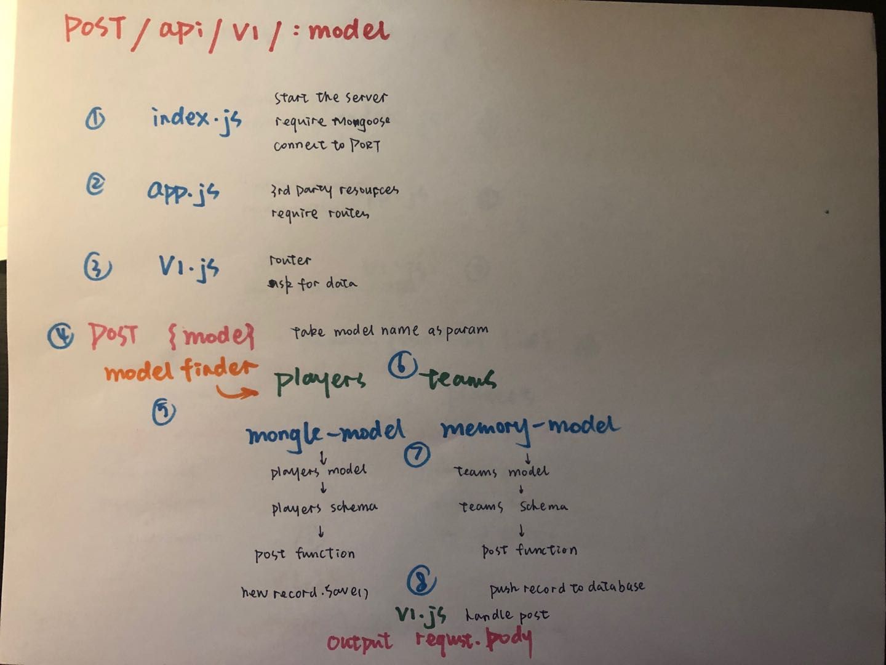
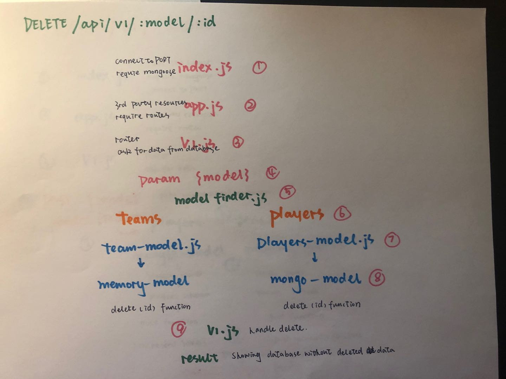
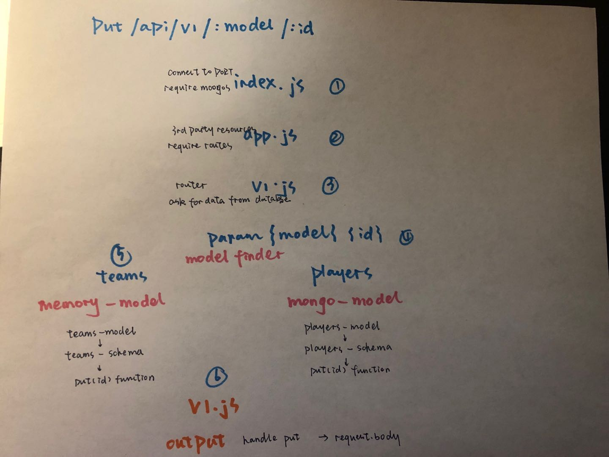

# lab--09
[CF](http://i.imgur.com/7v5ASc8.png) Lab-9
=================================================

## API-server
### Author: Vanessa
### Links and Resources
* [PR][]
#### Documentation
* jsdoc
* swagger

### Modules
Node

#### Models
##### mongo-model  => players-model
##### memory-model => teams-model

##### UML
(./assets/WechatIMG167.jpeg)

